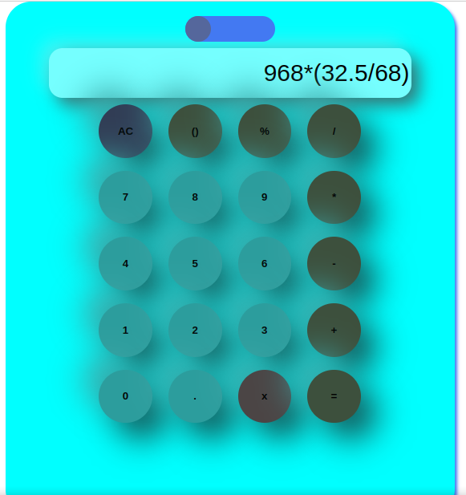

# Modern-Calculator

# Modern Simple Calculator

Welcome to the Modern Simple Calculator project! This is a stylish and functional calculator built with HTML, CSS, and JavaScript.

## Live Demo

Check out the live demo [here](https://phali003.github.io/Modern-Calculator/).

## Features

- **Stylish Design**: A modern and sleek interface for a pleasant user experience.
- **Basic Operations**: Perform addition, subtraction, multiplication, and division.
- **Toggle Light/Dark Mode**: Switch between light and dark themes for better visibility.
- **Responsive**: Works seamlessly on both desktop and mobile devices.

## Screenshots

### Light Mode

### Dark Mode

## How to Use

1. Open the live demo [here](https://phali003.github.io/Modern-Calculator/).
2. Use the buttons to input numbers and operators.
3. Press the "=" button to see the result.
4. Use the "AC" button to clear the screen.

## Technologies Used

- **HTML**: Structure of the calculator.
- **CSS**: Styling for the calculator.
- **JavaScript**: Functionality and logic for the calculator.

## License

This project is licensed under the MIT License - see the [LICENSE](LICENSE) file for details.

## Contact

If you have any questions or feedback, feel free to reach out:

- Email: priscphalis@gmail.com
- GitHub: [Phali003](https://github.com/Phali003)

Enjoy using the Modern Simple Calculator!
